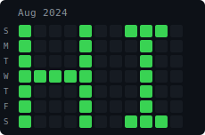

# Contribution Graph ASCII


> **DISCLAIMER**: This action creates commits with arbitrary `GIT_AUTHOR_DATE` timestamps.
> There is **no technical limit** on how far back commits can be backdated — including
> dates before Git (2005), before GitHub (2008), and even before Unix epoch (1970).
> We have successfully written "FIRLEFANZ" to the contribution graph starting
> **January 4, 1970**. Use responsibly. Contributions generated this way are
> indistinguishable from real activity on the graph. To undo, delete the `gh-pages`
> branch — contributions disappear within 24 hours.

GitHub Action that writes ASCII text on your GitHub contribution graph using backdated commits. Works with the default `GITHUB_TOKEN` — no PAT required.

For version history see the [CHANGELOG](CHANGELOG.md).

## Features

- Pure bash composite action (no Docker, no Python runtime)
- Works with default `GITHUB_TOKEN` (no PAT required)
- 5x7 bitmap font: A-Z, 0-9, space, common punctuation
- Raw `BITMAP` input for custom pixel art (Pacman, ghosts, logos, etc.)
- Backdating support via `START_DATE` input
- Pushes to `gh-pages` branch (counts for contribution graph without polluting `main`)
- Uses `github.actor` noreply email for correct contribution attribution
- Interference compensation: queries existing contributions and adjusts commit counts
- Inverse mode for profiles with heavy existing contributions
- Dry-run mode for previewing without pushing

## How It Works

1. Renders text (or raw bitmap) as a 7-row bitmap (7 rows = 7 days/week)
2. Maps each column to a week, each row to a day of the week
3. Optionally queries existing contribution counts for compensation
4. Creates backdated commits on an orphan `gh-pages` branch
5. Pushes to `gh-pages` (force on first run, appends on subsequent) — contributions appear within ~1 hour

GitHub counts contributions on the default branch and `gh-pages`. By using `gh-pages`, the art commits stay separate from your project history.

## Example

Default text `HI` rendered as a 7x11 bitmap (7 rows = days, 11 columns = weeks):

```text
█░░░█░░███░
█░░░█░░░█░░
█░░░█░░░█░░
█████░░░█░░
█░░░█░░░█░░
█░░░█░░░█░░
█░░░█░░███░
```

### Proof of Work

"HI" painted on the contribution graph starting August 4, 2024 (backdated from March 2026):



Verified via GitHub GraphQL API — each green cell has 4+ backdated commits authored as `<user>@users.noreply.github.com`.

## Usage

### Minimal (defaults to today)

```yaml
permissions:
  contents: write

steps:
  - uses: qte77/gha-contribution-ascii@v2
    with:
      TEXT: "HI"
```

No `TOKEN` input needed — the action uses the default `GITHUB_TOKEN` automatically.

### Backdate to a specific date

```yaml
- uses: qte77/gha-contribution-ascii@v2
  with:
    TEXT: "HI"
    START_DATE: "2024-08-04"
```

### Custom pixel art with BITMAP

```yaml
# Pacman eating a cherry (10 cols × 7 rows)
- uses: qte77/gha-contribution-ascii@v2
  with:
    BITMAP: "0111000001,1111100010,1111000100,1110011110,1111011110,1111101100,0111000000"
    START_DATE: "2025-10-26"
```

```text
░███░░░░░█
█████░░░█░
████░░░█░░
███░░████░
████░████░
█████░██░░
░███░░░░░░
```

### Full workflow with schedule

```yaml
name: Paint Contribution Graph
on:
  schedule:
    - cron: '0 6 * * *'
  workflow_dispatch:
    inputs:
      text:
        description: "Text to render"
        default: "HI"
      start_date:
        description: "Start date (YYYY-MM-DD), defaults to today"
      dry_run:
        type: boolean
        default: false

permissions:
  contents: write

jobs:
  paint:
    runs-on: ubuntu-latest
    steps:
      - uses: qte77/gha-contribution-ascii@v2
        with:
          TEXT: ${{ inputs.text || 'HI' }}
          START_DATE: ${{ inputs.start_date }}
          DRY_RUN: ${{ inputs.dry_run || 'false' }}
```

### Inputs

| Input | Default | Required | Description |
|---|---|---|---|
| `TEXT` | - | no* | ASCII text to render (ignored when `BITMAP` is set) |
| `BITMAP` | - | no* | Raw bitmap: 7 comma-separated rows of `0`/`1`. Overrides `TEXT` |
| `TOKEN` | `GITHUB_TOKEN` | no | GitHub token (default works, PAT for compensation) |
| `INTENSITY` | `4` | no | Fallback commit count when `COMPENSATE` is off |
| `INVERSE` | `false` | no | Invert colors (helps with existing contributions) |
| `START_DATE` | today | no | Start date (YYYY-MM-DD), adjusted to Sunday |
| `COMPENSATE` | `true` | no | Query existing contributions and adjust |
| `DRY_RUN` | `false` | no | Preview without pushing |

*Either `TEXT` or `BITMAP` is required.

### Dry Run

Preview the bitmap and commit plan without pushing:

```yaml
- uses: qte77/gha-contribution-ascii@v2
  with:
    TEXT: "HI"
    DRY_RUN: "true"
```

For token modes, interference handling, and multiple paintings see [Advanced Usage](docs/advanced-usage.md).

## Contribution Graph Behavior

GitHub counts contributions from commits on the default branch and `gh-pages` ([docs](https://docs.github.com/en/account-and-profile/setting-up-and-managing-your-github-profile/managing-contribution-settings-on-your-profile/why-are-my-contributions-not-showing-up-on-my-profile)). This action exploits that by creating commits with arbitrary `GIT_AUTHOR_DATE` — past (backdating) or future (forward-dating).

**Observed platform behavior:**

- **Past-dated commits** on `gh-pages` are indexed quickly (minutes), consistent with normal contribution processing
- **Future-dated commits** on `gh-pages` have unpredictable indexing — some appear, some don't. Indexing order appears to follow the git parent chain (HEAD backward), so commits appended last to the branch history get processed first
- **Deleted `gh-pages` contributions persist** as ghost data — GitHub does not fully garbage-collect contributions from deleted branches. Counts accumulate across branch incarnations
- **Multiple overlays** (same bitmap, repeated dispatches) increase commit count per cell → darker green. The graph uses [quartile-based coloring](https://docs.github.com/en/account-and-profile/setting-up-and-managing-your-github-profile/managing-contribution-settings-on-your-profile/viewing-contributions-on-your-profile) relative to your yearly max
- **Cannot erase** existing contributions — days with real activity always show green regardless of the painting

## Limitations

- Cannot make a day with existing contributions appear gray (fundamental GitHub limitation)
- Text wider than 52 characters exceeds the visible graph window
- Backdated commit indexing is asynchronous and not controllable via API
- Compensation requires a PAT (default `GITHUB_TOKEN` lacks `read:user` scope)

## Development

### Prerequisites

- [bats-core](https://github.com/bats-core/bats-core) for testing
- `jq` for JSON processing (contributions compensation)
- `gh` CLI for GitHub API queries

### Running Tests

```bash
bats tests/
```

## License

[Apache-2.0](LICENSE.md)
